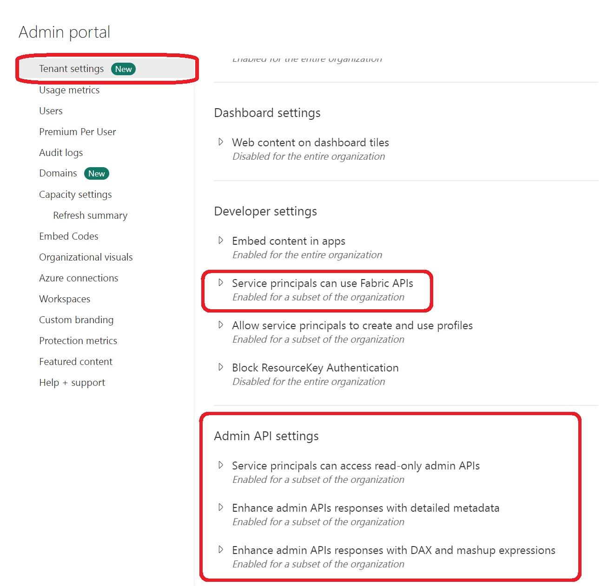
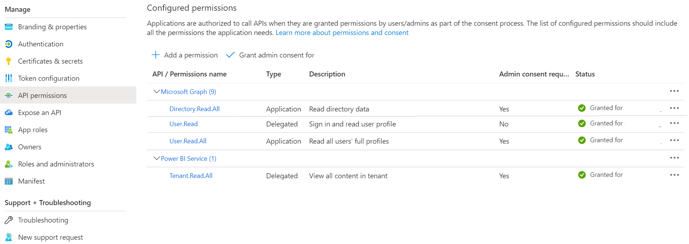

# Introduction 
This project looks to take advantage of all the work put into the original Power BI Monitor application and port it to Fabric. This project has several components including a means of containerizing the application and for those enthusiasts that like to use Jupyter Notebooks a whole section is devoted to "BUILDING" the application but using notebooks.

# Getting Started

What you need to do to use this application
1.	Create a Service Principal
2.	Grant permissions to the Service Principal  
    a. Fabric Admin Portal
    b. Service Principal API permissions
3.	Create your .env file
4.	Using the application  
    a. Native Python Application  
    b. Docker Container  
    c. Notebooks  
5. Build and Test


## Create a Service Principal  
To use this application you will need to [create a service principal](https://learn.microsoft.com/en-us/entra/identity-platform/quickstart-register-app) in Microsoft Entra. This service principal will need to be granted specific permissions within the [Fabric Admin Portal](https://app.fabric.microsoft.com/admin-portal) and for those that would also like to capture information about users licenses and other privileged information will have to grant permissions to Microsoft Graph.

## Grant Permissions to the Service Principal
The service principal can have several permissions granted depending upon how much information you want to extract from the Fabric estate. The following will outline the what can be done and which permissions need to be granted  

### Fabric Admin Portal Settings  
You can grant specific permissions to service principals to use Fabric APIs including getting metadata of your Power BI semantic models. To enable this the service principal must be put into a group and that group will then be given permission to access the Fabric APIs

</img>

### Service Principal API permissions  
In order for the service principal to leverage all of the functionality of the Fabric Montior application you will will need to grant specific API permissions for the service principal. The following can be granted when editing the Service Principal in Microsoft Entra under the Apps section and API permissions.

#### Graph Permissions  
|API/Permissions Name|Type|Description|  
|---|---|---|
|Directory.Read.All|Application|Read Directory Data|
|User.Read|Delegated|Sign in and read user profile|  
|User.Read.All|Application|Read all user's full profile

#### Power BI  
|API/Permissions Name|Type|Description|  
|---|---|---|
|Tenant.Read.All|Delegated|View all content in tenant|

</img>

## Create your .env  
Your `.env` file will file will hold your information about what operations you want the appliction to undertake and will also include configuration for the service principal of which includes the client_id, client_secret, tenant_id, and environment. This code repository specifically prohibits the uploading of the `.env` file to your code repository as this will expose secrets. There is work currently underway to add Managed Identity **STAY TUNED**

> NOTE: USE the enclosed .env.exmple file to build your `.env` file

## Using the Application  
This repository has three ways of using the application for gathering information from the Power BI and Fabric APIs. If you would like to deploy your application to a container then you can leverage the Dockerfiles in the containers folders. There are two Dockerfiles, one will execute the application upon startup and the other is set up to be run as a `CRON` job. Both of these images are built from the latest version of Ubuntu.

### Running as an Application  
You can run the code by using the following command from the root of this code to execute all the modules or you can run them singly:  
```
# to run the application
python -m app.monitor 

# to run individual modules
python -m app.modules.<module name>
```


### Build Docker Image  
from the root of the application you can type the following commands to build your image  
```
docker build -t monitor/fabric:1.0 -f ./containers/Dockerfile2
```
> To build a CRON job that can execute based on schedules use the following to build

```
docker build -t monitor/fabric:cron -f ./containers/Dockerfile
```

### Running Notebooks  
You can also run each module as a Jupyter notebook. This allows you to step through the processes and get a better understanding of the modules. Each notebook will have supporting links to the appropriate Power BI API or Fabric API.  The notebook will also allow you to experiment with the process and modify it to your needs.

> Notebooks can be found in the notebook folder and each notebook will be named after a module that it mimics.


# Build and Test
TODO: Describe and show how to build your code and run the tests. 

# Contribute
TODO: Explain how other users and developers can contribute to make your code better. 

If you want to learn more about creating good readme files then refer the following [guidelines](https://docs.microsoft.com/en-us/azure/devops/repos/git/create-a-readme?view=azure-devops). You can also seek inspiration from the below readme files:
- [ASP.NET Core](https://github.com/aspnet/Home)
- [Visual Studio Code](https://github.com/Microsoft/vscode)
- [Chakra Core](https://github.com/Microsoft/ChakraCore)